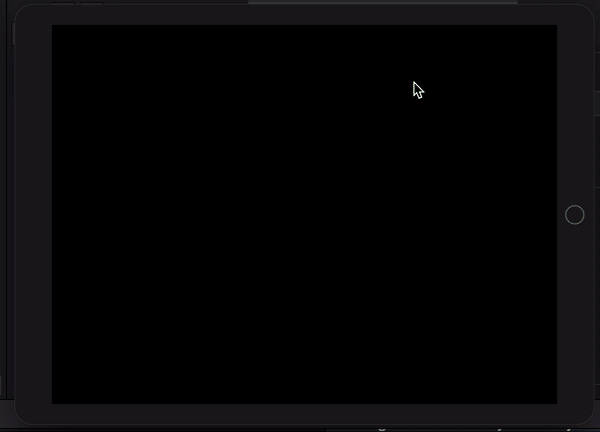

# Whack-A-Penguin

  

 
Based on the whack-a-mole game.

## Examples within this code
- SKCropNode
- SKTexture
- asyncAfter()
- Different SKAction types

## Demonstration
Small demonstration as to what the game does when on device.
 

